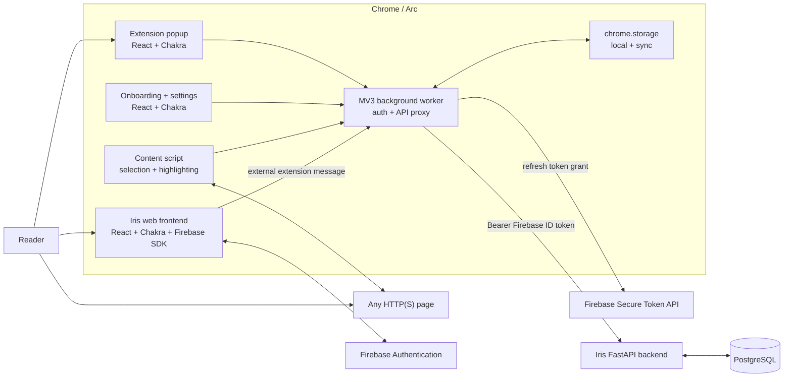
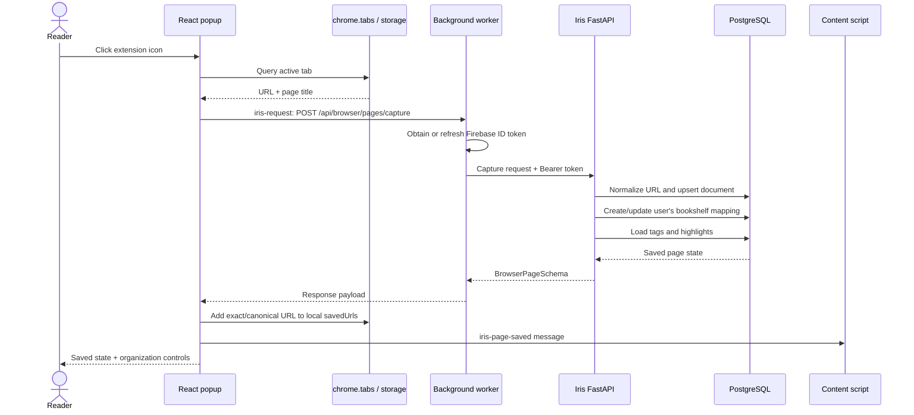
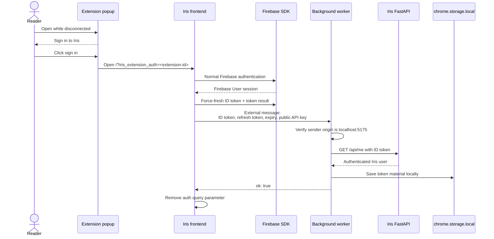
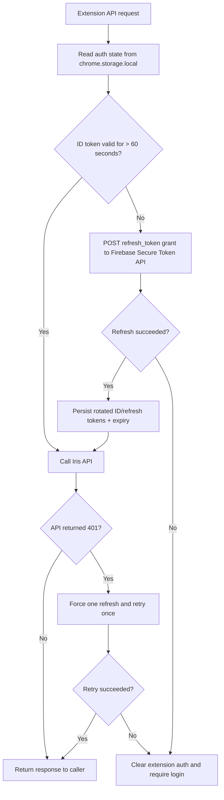
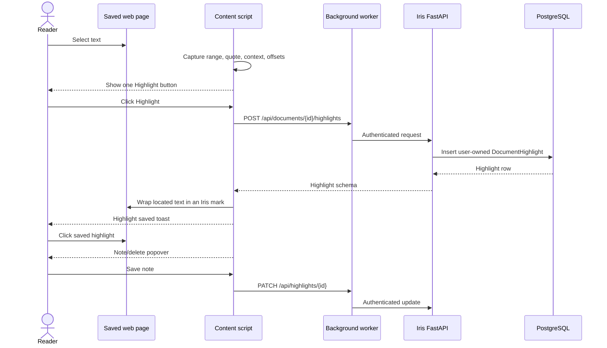
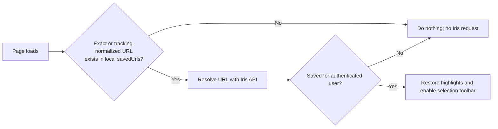
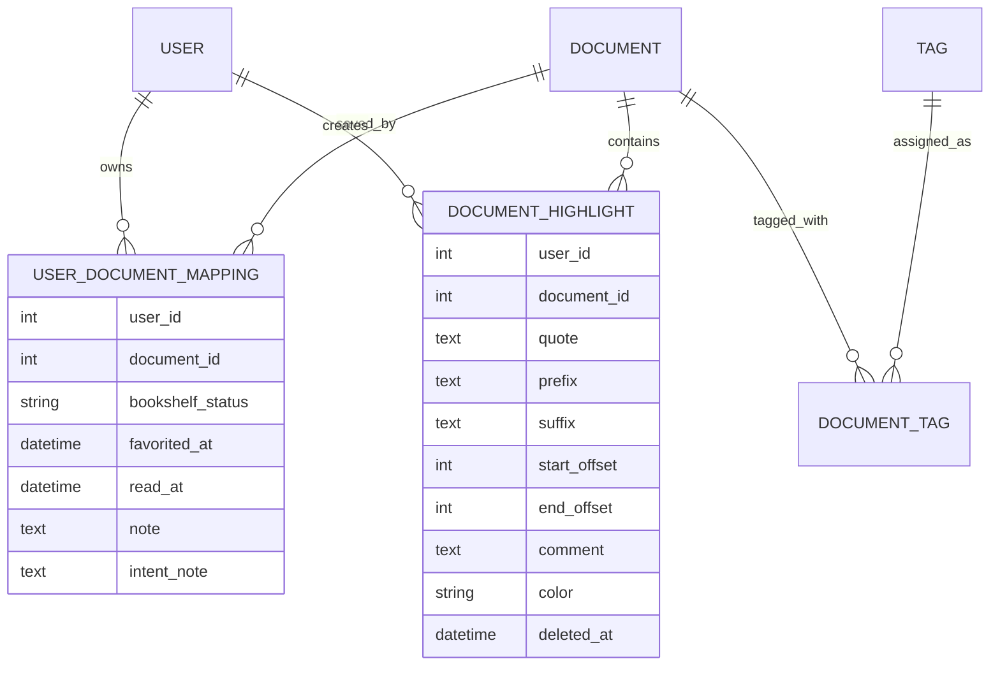
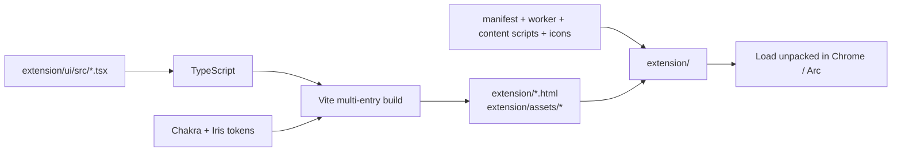

# Iris browser extension architecture

Status: implemented locally in extension v0.5.0  
Targets: Chrome, Arc, and other Chromium browsers using Manifest V3

## Executive summary

The Iris extension is a browser client for the existing Iris frontend and backend. It does not contain a second backend and it does not directly share a runtime with the Iris React app.

The extension has four browser-side parts:

1. A React + Chakra popup that saves the active page immediately and edits bookshelf metadata.
2. React + Chakra onboarding and settings pages.
3. A Manifest V3 background service worker that owns authentication and proxies every Iris API request.
4. A lightweight content script that adds highlighting UI to saved web pages and restores persisted highlights.

The normal Iris frontend performs Firebase login. After login, it passes a renewable Firebase session to the installed extension. The background worker stores that session locally, refreshes it automatically, and attaches a valid Firebase ID token to API requests. The FastAPI backend remains the source of truth for users, documents, bookshelf state, tags, and highlights.

## System context



## Component boundaries

| Component | Location | Responsibility | Deliberately does not do |
| --- | --- | --- | --- |
| Manifest | `extension/manifest.json` | Permissions, entry points, icons, content-script registration | Application logic |
| Popup | `extension/ui/src/popup.tsx` | Immediate capture, favorite/read/note/topic UI, sign-in and retry states | Store or refresh tokens; call FastAPI directly |
| Onboarding | `extension/ui/src/onboarding.tsx` | Explain save → highlight → return and initiate login | Authenticate directly |
| Settings | `extension/ui/src/settings.tsx` | Show account connection, open Iris, disconnect, open guide | Configure arbitrary API URLs or expose tokens |
| UI client | `extension/ui/src/chrome.ts` | Send typed request messages to the worker and open Iris tabs | Perform authenticated `fetch` itself |
| Background worker | `extension/background.js` | Own renewable auth, proxy requests, retry after 401, receive frontend auth handoff | Render UI or inspect page DOM |
| Content script | `extension/content.js` | Activate saved pages, show one-button highlight toolbar, render/edit/delete highlights | Own authentication or run Chakra inside host pages |
| Anchoring library | `extension/anchoring.js` | Locate saved quotations by offsets and contextual quote matching | Network or DOM mutation |
| FastAPI browser routes | `backend/iris/routes/api.py` | Capture/resolve pages and manage highlights/bookshelf state | Browser UI |

The popup/onboarding/settings use the same React, Chakra, typography, and Iris color tokens as the core frontend. They are separate extension components rather than imports from the frontend application bundle. The content script intentionally remains framework-free so Iris styles do not leak into host websites and host styles do not alter the extension UI.

## One-click page save

Opening the popup is the save action. There is no second confirmation button.



Important behavior:

- Capture is idempotent by normalized document URL.
- Repeat capture preserves existing notes and tags unless the request explicitly supplies replacements.
- The page is saved before the user edits favorite, read state, note, or topics.
- The popup does not turn an existing page selection into the document note. Text selection belongs to the highlight flow.
- The backend is authoritative. Local `savedUrls` is an activation/privacy hint, not the saved-page database.

## Authentication architecture

### Why the extension needs its own session material

The Iris web app and a Chrome extension have different origins and storage sandboxes. Firebase login cookies/state inside `http://localhost:5175` are not automatically available to `chrome-extension://<extension-id>`.

The frontend therefore performs normal Firebase login and explicitly hands the installed extension renewable Firebase credentials. The extension does not show or embed its own Google login flow.

### Login handoff



The external message is accepted only from the configured Iris frontend origin. The background worker validates the ID token against `/api/me` before persisting the session.

### Automatic token refresh

Firebase ID tokens are short-lived. The extension stores the Firebase refresh token so the site and extension do not drift into separate signed-in states.



All extension surfaces use this path. The popup and content script do not attach tokens independently.

### Auth storage

`chrome.storage.local` contains:

- `authToken`: current Firebase ID token.
- `authRefreshToken`: Firebase refresh token.
- `authExpiresAt`: ID-token expiration time in epoch milliseconds.
- `firebaseApiKey`: public Firebase web API key required by the secure-token endpoint.
- `savedUrls`: bounded list of locally known saved URLs.

`chrome.storage.sync` contains non-secret extension state:

- `apiBase`: local API origin for the prototype.
- `onboardingComplete`: onboarding connection state.

Tokens are intentionally stored in `local`, not `sync`, so they do not sync through the reader's browser account. Disconnecting clears all auth keys. A packaged production version should also consider explicit server-side session revocation and a more formal extension-session exchange if stronger centralized revocation is required.

## API communication

Extension callers send a runtime message rather than calling FastAPI directly:

```text
{ type: "iris-request", path: "/api/...", options: { method, body, headers } }
```

The background worker:

1. Loads or refreshes the Firebase token.
2. Adds `Authorization: Bearer <id-token>`.
3. Calls the configured Iris API base.
4. Retries once after a 401 using a forced token refresh.
5. Returns `{ ok, status, payload }` to the caller.

This centralization is important because Manifest V3 workers are ephemeral. Durable auth state lives in Chrome storage, while the worker can safely stop and restart between requests.

### Backend endpoints used

| Endpoint | Method | Purpose |
| --- | --- | --- |
| `/api/me` | GET | Validate the Firebase token and resolve the Iris user |
| `/api/browser/pages/capture` | POST | Idempotently save the active URL and return entry + highlights |
| `/api/browser/pages/resolve?url=...` | GET | Resolve saved state when revisiting a locally known URL |
| `/api/documents/{id}/bookshelf` | PATCH | Update favorite, read state, note, intent note, or topics |
| `/api/documents/{id}/highlights` | GET/POST | List or create user-owned highlights |
| `/api/highlights/{id}` | PATCH/DELETE | Update the highlight note/color or soft-delete it |

## Highlight lifecycle

Highlighting activates only after a page has been explicitly saved.



The selection is converted into a payload before the toolbar is clicked. This matters because clicking browser UI normally collapses the page selection. The toolbar has one action; notes are added afterward by clicking the persisted highlight.

### Anchoring and restoration

Each highlight stores:

- Exact selected `quote`.
- Up to 64 characters of `prefix` and `suffix` context.
- `start_offset` and `end_offset` in the concatenated eligible page text.
- Optional note in the backend's `comment` field.
- Color and timestamps.

On revisit, restoration tries:

1. Stored offsets when the text at those offsets still matches the quote.
2. Exact quote search scored using prefix and suffix context.
3. No placement if neither strategy is reliable.

Scripts, styles, form controls, contenteditable regions, and Iris-owned floating UI are excluded from the page-text model. PDFs, canvas-rendered text, cross-origin frames, shadow DOM, and highly dynamic virtualized pages are not fully supported in the current version.

## Privacy and permission model

The manifest registers the content script on HTTP(S) pages because selection UI must be available immediately after a save. That broad injection permission does not mean every visited URL is sent to Iris.

The privacy gate is:



Relevant permissions:

- `activeTab`: read the active tab only after the user invokes the extension.
- `scripting`: inspect the active page when necessary.
- `storage`: persist auth state and saved-URL activation hints.
- HTTP(S) content-script matches: provide in-page highlighting.
- `securetoken.googleapis.com`: refresh Firebase tokens.
- `externally_connectable` for the Iris frontend: receive the authenticated handoff.

The extension does not request Chrome history permission and does not continuously upload general browsing activity.

## Backend data model



Highlights and bookshelf mappings are scoped by `user_id`. Highlight update/delete routes look up owned rows, so another authenticated user receives a not-found response rather than access to the annotation.

## UI and build architecture

Source UI lives under `extension/ui/`. Vite has three HTML entry points:

- `popup.html`
- `onboarding.html`
- `settings.html`

The build writes compiled HTML and assets into the unpacked `extension/` root because Chrome loads that directory directly. The background worker, content script, anchoring library, content CSS, icons, and manifest remain hand-authored extension assets.



Build and validate:

```bash
npm --prefix extension/ui install
npm --prefix extension/ui run build
python3 -m json.tool extension/manifest.json >/dev/null
node --check extension/background.js
node --check extension/content.js
node extension/anchoring.test.js
npm --prefix frontend run build
git diff --check
```

After changing the manifest, background worker, or content script, reload the extension in `chrome://extensions` or `arc://extensions`. Existing page tabs must then be refreshed because Chrome does not replace an already-injected content-script execution context.

## Local development topology

Current development origins are compiled into the prototype:

| Service | Origin |
| --- | --- |
| Iris frontend/login bridge | `http://localhost:5175` |
| Iris FastAPI backend | `http://127.0.0.1:8000` |
| Firebase token refresh | `https://securetoken.googleapis.com` |

Use `localhost` for the frontend because Firebase authorizes it as a domain; `127.0.0.1` is a different Firebase origin and the current Firebase console rejects raw IPs in its authorized-domain form.

The frontend and backend must come from the same worktree as the loaded extension. When multiple development worktrees auto-restart servers on the same ports, verify their working directories with `lsof` before debugging extension behavior.

## Failure behavior

| Failure | Current behavior |
| --- | --- |
| No extension auth | Popup and onboarding offer Sign in to Iris |
| ID token near expiry | Worker refreshes before making the request |
| API returns 401 | Worker forces one refresh and retries |
| Refresh rejected | Auth storage is cleared and login is required |
| Backend unavailable | Popup shows a retryable error; content UI shows a toast |
| Unsupported browser page | Popup explains that only regular HTTP(S) pages can be saved |
| Saved URL absent locally | Content script makes no Iris request |
| Highlight cannot be re-anchored | It remains detached rather than highlighting the wrong passage |
| Extension reloaded while a page is open | Old context may report “Extension context invalidated”; refresh the page |

## Architectural tradeoffs and next steps

Current choices optimize for a simple local vertical slice:

- Firebase refresh credentials live in extension-local storage. A production hardening option is a backend-issued, revocable extension session exchanged through a short-lived one-time code.
- Frontend and extension duplicate the Iris Chakra system configuration. A shared package should eventually export tokens and reusable primitives to prevent drift.
- Local origins are hardcoded. Production builds should use environment-specific configuration generated at build time.
- `savedUrls` is bounded local state, not a complete offline index. A production sync design may need a compact server-derived activation index or explicit per-page resolution rules.
- Content scripts run in the page's DOM environment. Shadow DOM encapsulation for Iris floating UI would further reduce host-style collisions.
- Refresh-token and API behavior should gain unit tests around proactive refresh, refresh rotation, retry-once behavior, and terminal logout.

## File map

```text
extension/
├── manifest.json                  Browser capabilities and entry points
├── background.js                  Renewable auth and central API proxy
├── content.js                     Saved-page activation and annotation UI
├── content.css                    Host-page highlight/toolbar styles
├── anchoring.js                   Pure highlight-location strategies
├── anchoring.test.js              Anchoring unit checks
├── icons/                         Browser action icons
├── popup.html                     Generated popup entry
├── onboarding.html                Generated onboarding entry
├── settings.html                  Generated settings entry
├── assets/                        Generated React/Chakra bundles
└── ui/
    ├── vite.config.ts             Multi-entry build into extension root
    ├── package.json               React/Chakra build dependencies
    └── src/
        ├── popup.tsx
        ├── onboarding.tsx
        ├── settings.tsx
        ├── chrome.ts              Runtime-message client
        ├── system.tsx             Iris Chakra system
        └── ui.css

frontend/src/
├── App.tsx                        Firebase login and extension handoff
└── firebase.ts                    Firebase app configuration/public API key

backend/iris/
├── routes/api.py                  Capture, resolve, bookshelf, highlight APIs
├── dao/bookshelf.py               Per-user save/update behavior
├── dao/highlights.py              Highlight ownership and persistence
└── models/user.py                 Mapping, tags, and highlight models
```
